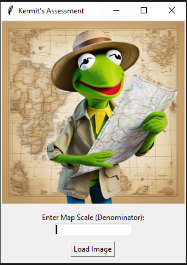
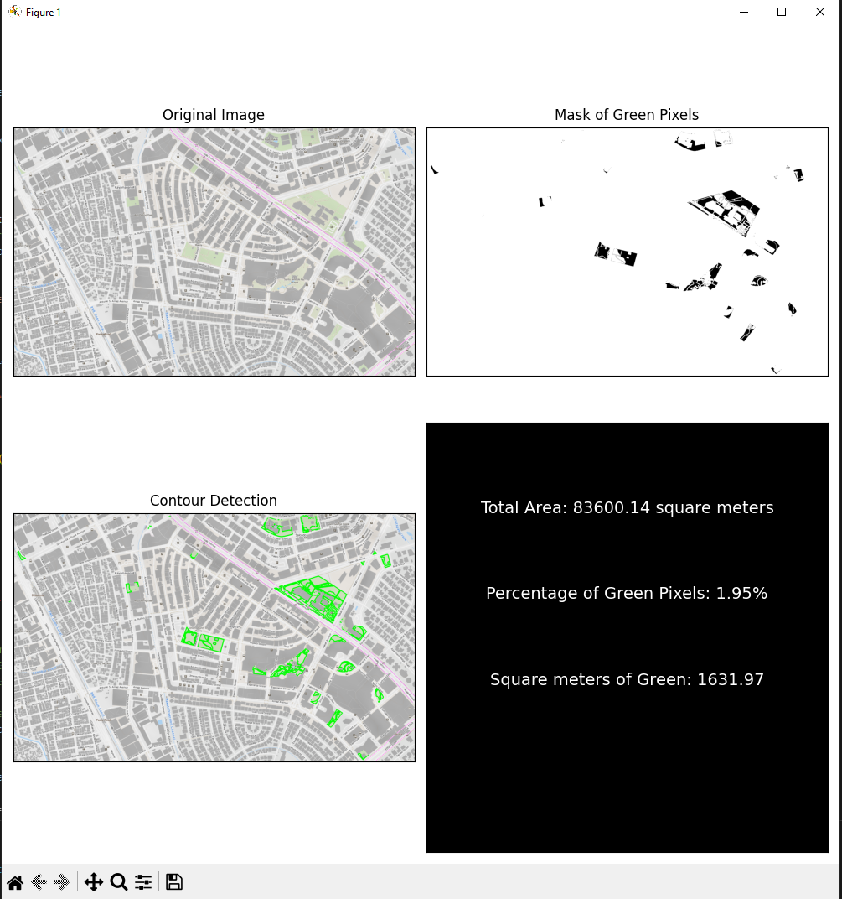

# Assessing Urban Green Spaces for Sustainable Urban Development using Image Processing Techniques

This Python application uses image processing techniques to assess urban green spaces.

## Features
- **Image processing techniques:** Utilizes techniques such as thresholding, contour detection, and pixel area calculations to analyze urban green spaces
- **Interactive GUI:** User-friendly GUI built with Tkinter
- **Visualization:** Displays original image, mask of green pixels, and contour detection for visual analysis
- **Area calculation:** Calculates the total area of the image and percentage of green pixels

## Libraries 
The following libraries are used in this project:

- **Tkinter**: Python's standard GUI (Graphical User Interface) toolkit.
- **OpenCV**: Open Source Computer Vision Library for image processing.
- **NumPy**: Library for numerical computing in Python.
- **Matplotlib**: Library for creating visualizations in Python.
- **Pillow**: Python Imaging Library for image processing tasks.

## Installation 
After cloning the repository navigate to the project directory and install the required Python libraries:
```Python
pip install -r requirements.txt
```
Then you can run the application:
```Python
python MachineProj.py
```

## Usage
1. Launch the application
2. Input the scale denominator (If you are unfamiliar with GIS, I have included a sample image used for the research in the input folder with the file name being the scale denominator)
3. Upload the Image

Here is what you are expected to see:





## License 
This project is licensed under the MIT License - see the LICENSE file for details.
